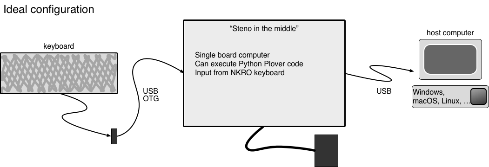
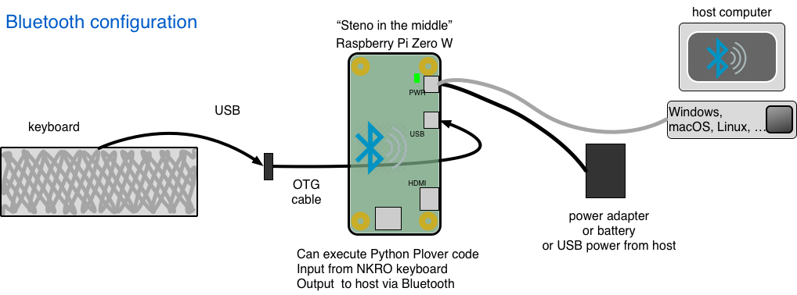

# steno-in-the-middle
A stand-alone, hardware+software interface that attaches between a keyboard and host computer.

Uses Plover.

[See: ](Steno in the middle README.md)

https://github.com/babarrett/steno-in-the-middle/blob/master/2pis_config.png)

